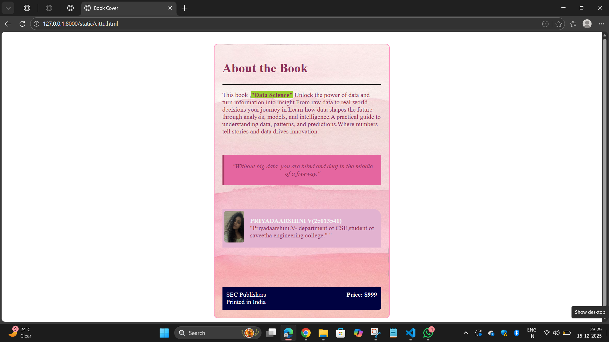

# Ex.05 Book Cover Page Design
## Date:15/12/2025

## AIM:
To design a book back cover page using HTML and CSS.

## DESIGN STEPS:

### Step 1:
Create a Django Admin project.

### Step 2:
Create an app in the Django interface.

### Step 3:
Create a folder named 'static' in the app folder.

### Step 4:
Create a new HTML file in the static folder.

### Step 5:
Write the HTML code with relevant CSS properties.

### Step 6:
Choose the appropriate style and color scheme.

### Step 7:
Insert the images in their appropriate places.

### Step 8:
Publish the website in the LocalHost.

## PROGRAM:
```
cittu.html

<html>
<head>
    <title>Book Cover</title>
    <link href="pri.css" rel="stylesheet">
</head>

<body>

<div class="box">
    <h1>About the Book</h1>
    <hr style="height:2px;border-width:0;color:rgb(15, 15, 15);background-color:rgb(8, 8, 8)">
    <p>
        This book ,<b style="background-color:yellowgreen;">"Data Science"</b> Unlock the power of data and turn information into insight.From raw data to real-world decisions your journey in Learn how data shapes the future through analysis, models, and intelligence.A practical guide to understanding data, patterns, and predictions.Where numbers tell stories and data drives innovation.
    </p>

    <div class="quote">
        "Without big data, you are blind and deaf in the middle of a freeway."
    </div>

    
    <div class="author">
        

        <p>
            <b>PRIYADAARSHINI V(25013541)</b><br>
            "Priyadaarshini.V- department of CSE,student of saveetha engineering college."                                                    "
            <br>
            
        </p>
    </div>

    <div class="footer">
        <div>SEC Publishers<br>Printed in India</div>
        <div><b>Price: $999</b></div>
    </div>

</div>

</body>
</html>
```
```
pri.css

body {
            font-size: Arial;
            background:linear-gradient(to bottom,rgb(255, 255, 255));
        }
        .box {
            height: 650px;
            width: 400px;
            background-image:url('PINK.jpg');
            background-size: cover;
            color:rgb(139, 45, 86);
            padding: 20px;
            margin: 30px auto;
            border: 2px solid rgb(255, 150, 194);
            border-radius: 10px;
        }
        .quote {
            background: rgb(229, 102, 160);
            padding: 20px;
            border-left: 5px solid rgb(164, 58, 97);
            margin: 50px 0;
            font-style: italic;
            text-align: center;
            
        }
        .author {
            display: flex;
            gap: 15px;
            background:rgb(226, 178, 208);
            padding: 5px;
            margin-top: 60px;
            border-start-end-radius: 20px;
        }
        .author b{
            color:rgb(243, 243, 243);
        }
        .author img {
            width: 50px;
            height: 80px;
            border-radius: 5px;
        }
        .footer {
            background: rgb(0, 2, 65);
            color: white;
            padding: 10px;
            display: flex;
            justify-content: space-between;
            margin-top: 100px;
            border-end-end-radius: 5px;
        }
```


## OUTPUT:


## RESULT:
The program for designing book back cover page using HTML and CSS is completed successfully.
